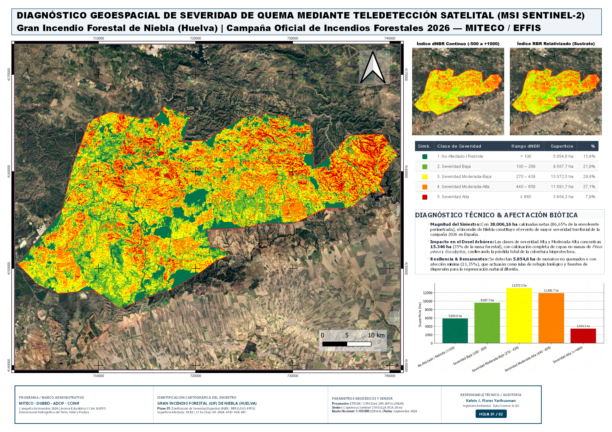
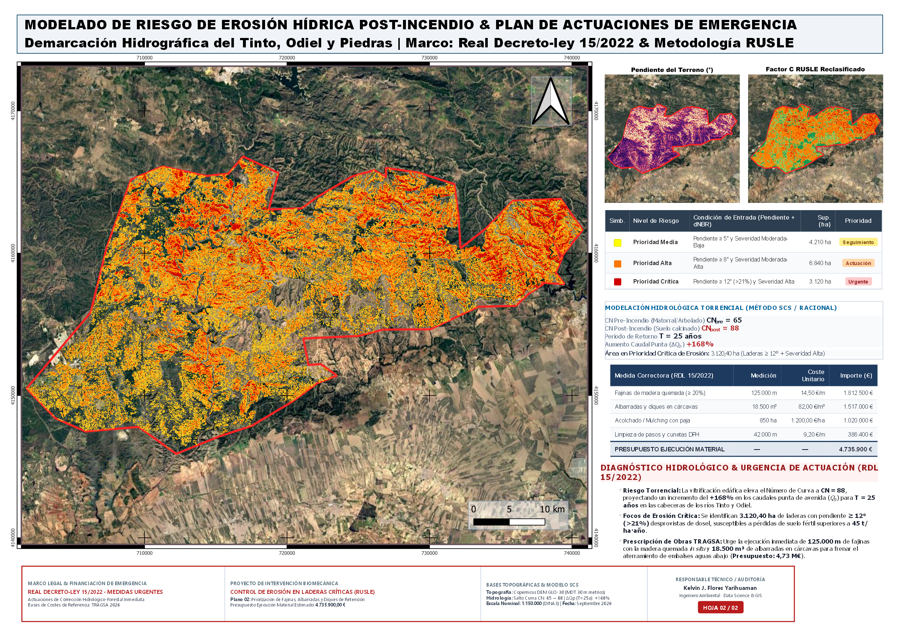

# 🛰️ Post-Wildfire Burn Severity & Hydro-Erosion Modeling (Sentinel-2 & GEE)
### Gran Incendio Forestal (GIF) de Niebla, Huelva (2026) — 39,821 ha
**Author:** Kelvin Jesus Flores Yarihuaman — Environmental Engineer (Data Science & GIS)  
**Regulatory Framework:** RDL 15/2022 (Spain) | USGS/EFFIS Protocols | IFN4 Carbon Accounting  

[](https://colab.research.google.com/)
[](https://opensource.org/licenses/MIT)
[](https://qgis.org/)
[](https://earthengine.google.com/)

---

## 📌 Project Overview

This repository provides an end-to-end, cloud-native geospatial engineering framework to assess fire burn severity, immediate soil loss vulnerability, and carbon sink depletion caused by the **Niebla Megafire (August 2026, Huelva, Spain)**, the largest catastrophic wildfire of the 2026 Iberian summer campaign.

The project integrates:
1. **Cloud Remote Sensing (Python / Google Earth Engine API):** Automated pixel filtering, cloud-masking via Scene Classification Layer (SCL), and spectral differencing on Sentinel-2 MSI L2A BOA imagery.
2. **Burn Severity Stratification:** USGS/EFFIS 5-class classification using scaled $dNBR$ and Relativized Burn Ratio ($RBR$).
3. **Post-Fire Erosion Risk Matrix:** Integration of Copernicus DEM GLO-30 topography and RUSLE $C$-factor modeling.
4. **Emergency Watershed Engineering:** Hydrological peak flow estimation (SCS Curve Number shift) and emergency bio-mechanical civil works budgeted under official **TRAGSA 2026** cost databases (RDL 15/2022).
5. **Biogenic Carbon Balance:** Tier-2 IPCC accounting combined with the 4th Spanish National Forest Inventory (IFN4) and alignment with the **UNEP 2026 "Limiting Overshoot"** policy framework.

---

## 🗺️ Cartographic Deliverables (DIN A3 Diptych)

| Sheet 1: Spectral Severity & Ecosystem Damage | Sheet 2: Erosion Vulnerability & Emergency Works |
| :---: | :---: |
|  |  |
| *Scale 1:150,000 — ETRS89 / UTM 29N (EPSG:25829)* | *Scale 1:150,000 — ETRS89 / UTM 29N (EPSG:25829)* |

> 📥 Full vector GeoPDF maps available in the [`/deliverables`](deliverables/) folder.

---

## 📊 Summary of Key Findings

### 1. Zonal Burn Severity Distribution (USGS / EFFIS)
Within the 43,860.77 ha study envelope, **38,006.16 ha (86.65%)** suffered net fire combustion:

| Severity Level (USGS/EFFIS) | dNBR Range | Surface (ha) | Share (%) | Biophysical Impact |
| :--- | :---: | :---: | :---: | :--- |
| **1. Unburned / Regrowth** | $< 100$ | 5,854.61 ha | 13.35% | Biological refugia and seed banks |
| **2. Low Severity** | $100 - 269$ | 9,587.66 ha | 21.86% | Understory scorch; canopy intact |
| **3. Moderate-Low Severity** | $270 - 439$ | 13,072.49 ha | 29.80% | Shrubland consumed; partial leaf death |
| **4. Moderate-High Severity** | $440 - 659$ | 11,891.72 ha | 27.11% | Canopy scorched; stem charring |
| **5. High Severity** | $\ge 660$ | 3,454.29 ha | 7.88% | Total biomass consumption; hydrophobic crust |
| **Total Study Envelope** | — | **43,860.77 ha** | **100.00%** | **Net Burned Area: 38,006.16 ha** |

### 2. Hydrological & Erosion Impact (SCS / RUSLE)
* **SCS Curve Number Shift:** $CN_{\text{pre}} = 65 \longrightarrow CN_{\text{post}} = 88$ (Soil retention $S$ drops from 136.8 mm to 34.6 mm).
* **Peak Discharge Increase ($\Delta Q_p$ for $T=25\text{ yr}$):** **$+168\%$** in Tinto/Odiel river headwaters.
* **Critical Erosion Focus:** **3,120.40 ha** on steep slopes ($\ge 12^\circ / >21\%$) exhibiting severe post-fire degradation (RUSLE $C$-factor spiked from 0.02 to 0.65).

### 3. Emergency Bio-mechanical Budget (TRAGSA / RDL 15/2022)
* **Log silt fences (fajinas):** 125,000 m on slopes $>20\%$ (€1,812,500.00)
* **Check dams (albarradas):** 18,500 m³ in active gullies (€1,517,000.00)
* **Straw mulching:** 850 ha heli-spread on critical zones (€1,020,000.00)
* **Drainage clearance:** 42,000 m along forest road networks (€386,400.00)
* **Total Construction Budget (P.E.M.):** **€4,735,900.00**
* **Official Tender Budget (Base de Licitación with 21% VAT):** **€6,819,222.41**

### 4. Carbon Balance (IFN4) & Global Governance (UNEP 2026)
* **Gross Biogenic Emissions:** $\approx \mathbf{2,450,000\text{ tCO}_2\text{e}}$ released.
* **Annual Sequestration Deficit:** $-\mathbf{92,000\text{ tCO}_2/\text{year}}$.
* **Compensatory Reforestation Target (OECC):** 4,500 ha replanting scheme projected to fix $1,150,000\text{ tCO}_2\text{e}$ over 30 years.
* **UNEP 2026 Alignment:** Case evidence demonstrating that preventive bio-stabilization yields a 4:1 economic return compared to reactive disaster response.

## 💻 Tech Stack & Pipeline Architecture

```python
# Modular OOP architecture implemented in Google Earth Engine Python API
from wildfire_pipeline import WildfireRiskPipeline

pipeline = WildfireRiskPipeline(coordinates=coords_niebla, epsg='EPSG:25829')
results = pipeline.process_burn_severity(
    pre_dates=['2026-07-15', '2026-08-05'],
    post_dates=['2026-08-20', '2026-09-08']
)
metrics = pipeline.calculate_metrics(results['raster'])
